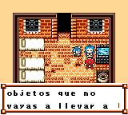
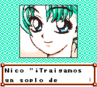
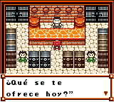
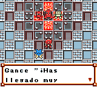

# Azure Dreams (Game Boy Color) — Traducción al español

Parche de traducción fan al español de **Azure Dreams** para Game Boy Color (versión USA), por **Fveralv**.

**Web del proyecto:** [https://fjveralv.github.io/Parche-traduccion-Azure-Dreams-GBC/](https://fjveralv.github.io/Traduccion-Azure-Dreams-GBC/)

 
 

## Descarga

[`AzureDreams_GBC_ES.ips`](AzureDreams_GBC_ES.ips) — Beta 1 (24/09/2026), 114 KB.

## ROM necesaria

| Dato | Valor |
|---|---|
| Juego | Azure Dreams (USA) — Game Boy Color |
| Tamaño | 1 048 576 bytes (1 MB) |
| CRC32 | `71D52876` |
| MD5 | `464ACBE3C82887DB897C39CDBA877237` |
| SHA-1 | `1EBC365058DBB4D4F7CCAD6185F4364D584BF250` |

El parche **no incluye el juego**: necesitas tu propia copia legal.

## Cómo aplicar el parche

1. Abre [Rom Patcher JS](https://www.marcrobledo.com/RomPatcher.js/) (o Flips / Lunar IPS).
2. Selecciona tu `Azure Dreams (USA).gbc` y comprueba que el CRC32 es `71D52876`.
3. Selecciona `AzureDreams_GBC_ES.ips` y aplica el parche.

## Qué está traducido

- Toda la historia y los diálogos (978 bloques), incluidos los mensajes de combate, objetos, trampas y estaciones de la Torre.
- Nombres y descripciones de objetos (115), monstruos (123), hechizos (62) y técnicas (68).
- Menús de texto: ascensor, guardado, órdenes al familiar, establo, fusión, estados e intercambio.
- Letras españolas (á é í ó ú ñ ¿ ¡ ü y mayúsculas acentuadas) dibujadas en la fuente del juego.

Los nombres propios (Kou, Kewne, Guy, Wreath, Monsbaiya, nombres de monstruos...) se mantienen como en el original.

## Pendiente

- Textos dibujados como gráficos: pantalla de título (*New game / Continue / Exchange*), menú de comandos y pantalla de introducción del nombre.

## Aviso

Proyecto de traducción fan. Azure Dreams es © Konami; todas las marcas pertenecen a sus respectivos propietarios.
No se distribuye ningún archivo del juego.

¿Te gusta lo que hago? Puedes apoyarme en [Ko-fi](https://ko-fi.com/S6P527KUBF). ☕
